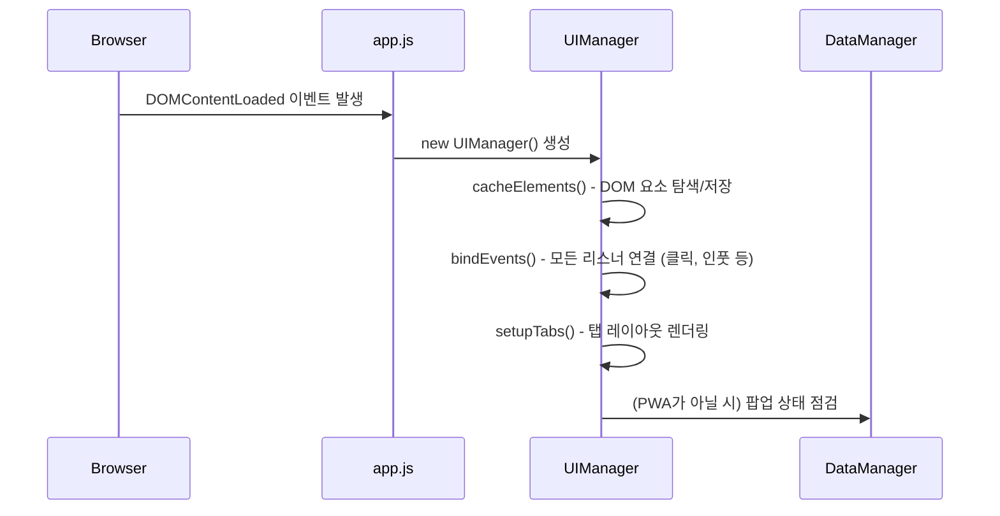
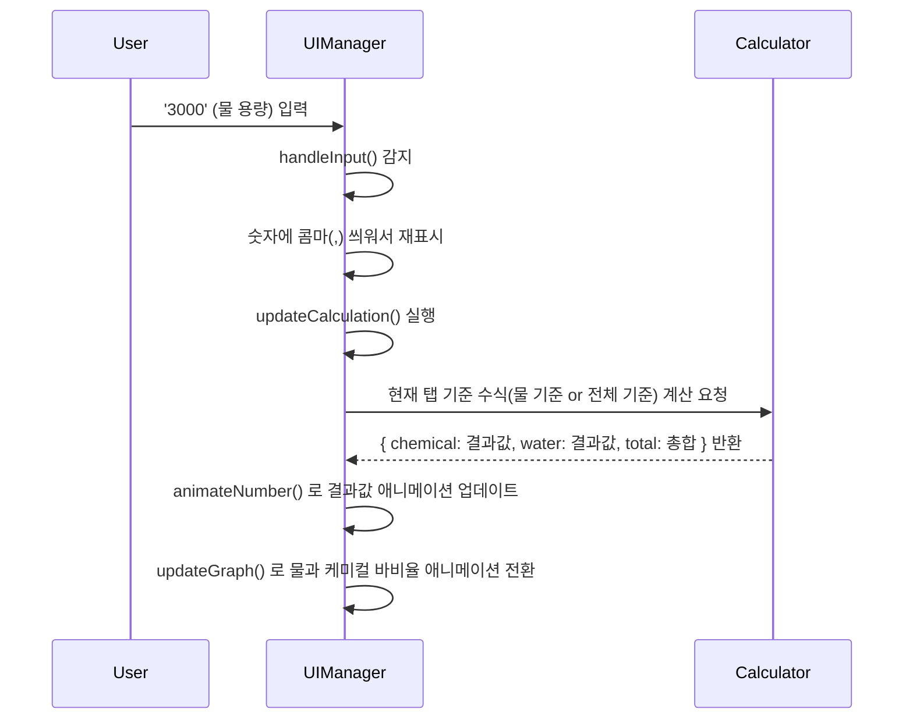
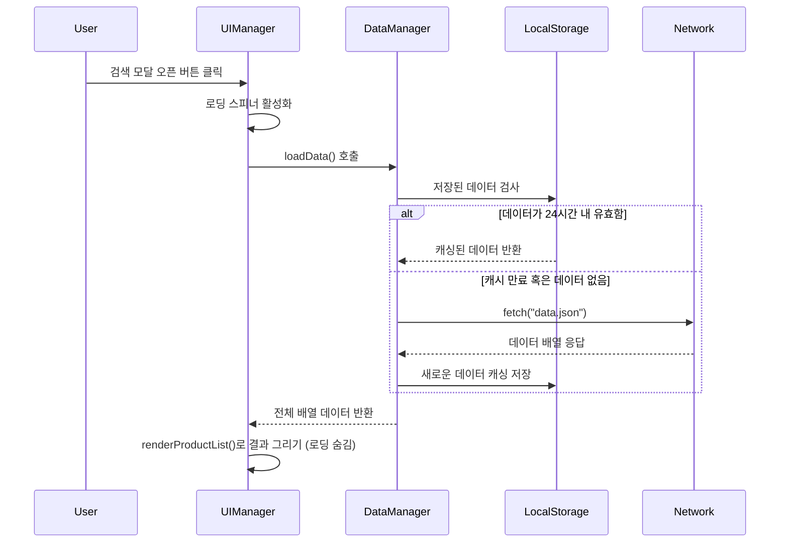

# (R)atio 프로젝트 프로세스 구조 및 아키텍처 명세서

본 문서는 `chemical-ratio` 프로젝트의 전반적인 동작 프로세스 및 리팩토링된 모듈 구조에 대한 상세한 설명을 제공합니다. 

---

## 1. 아키텍처 개요

기존에 하나의 거대한 `common.js` 파일에 섞여 있던 로직을 **관심사 분리(Separation of Concerns)** 원칙에 따라 여러 ES6 모듈로 나누었습니다. 이를 통해 각 모듈이 단일 책임을 가지게 되어 코드 가독성, 유지보수성, 그리고 확장성이 크게 개선되었습니다.

### 🚗 모듈 구성 및 역할

- **`app.js` (Entry Point)**
  - 애플리케이션의 시작점입니다. HTML 문서가 모두 렌더링된 후(`DOMContentLoaded`), 사용자 인터페이스 및 이벤트를 제어하기 위해 `UIManager` 클래스의 인스턴스를 생성합니다.
  
- **`Config.js` (설정 및 상수 관리)**
  - 애플리케이션 곳곳에서 쓰이는 DOM 셀렉터(Selector), 애니메이션 지속 시간, 데이터 Fetch URL, 로컬 스토리지 Key값 등의 하드코딩된 값들을 한곳에서 관리합니다.
  - 이를 통해 나중에 클래스명이나 ID가 변경되어도 이 파일만 수정하면 애플리케이션 전체에 반영됩니다.

- **`Utils.js` (유틸리티 함수)**
  - DOM 탐색(`select`, `selectAll`), 문자열/숫자 처리(콤마 추가/제거), XSS 보안을 위한 특수문자 이스케이프, 디바이스 환경 검사(모바일 기기 여부) 등 순수하게 "기능적인 도움"을 주는 정적 메서드들을 포함합니다.
  - 다른 모듈에 의존하지 않는 순수 함수 위주로 작성되어 사이드 이펙트(부작용)가 없습니다.

- **`Calculator.js` (핵심 비즈니스 로직)**
  - 세차 용품 희석비를 계산하는 두뇌에 해당합니다. 
  - (1) 탭 1: '설정된 물 용량에 맞는 케미컬 양 도출'
  - (2) 탭 2: '전체 용량(물+케미컬) 기준에 맞는 각각의 비율 도출'
  - 입력값의 무결성을 검증하고 항상 안전한 숫자(0 이상)를 반환하도록 설계되었습니다.

- **`DataManager.js` (데이터 레이어)**
  - 케미컬 제품 목록 데이터(`data.json`)를 가져오는 책임을 집니다.
  - 매번 서버에서 데이터를 불러오지 않도록 브라우저의 `localStorage`를 활용해 24시간 동안 캐싱 처리합니다.
  - 검색 모달에서 입력된 문자열을 통해 데이터를 필터링하는 로직도 포함되어 있습니다.

- **`UIManager.js` (UI 및 이벤트 관리자)**
  - 화면의 렌더링 및 사용자가 일으키는 모든 상호작용(클릭, 타이핑, 스크롤 등)을 관리합니다.
  - **이벤트 위임(Event Delegation)** 방식을 적극 활용하여 각각의 버튼마다 이벤트를 걸지 않고, 최상위 `document`에서 클릭 이벤트를 감지하여 조건에 맞는 동작을 분기 실행합니다(메모리 절약 및 성능 최적화).
  - 값이 바뀔 때마다 `Calculator.js`를 호출해 결과를 받고, 이를 화면(숫자 애니메이션, 게이지 바)에 반영합니다.

---

## 2. 핵심 동작 프로세스 

### ⚙️ 초기화 프로세스

### 🧮 용량 계산 및 화면 렌더링 프로세스
사용자가 인풋 창에 '물 용량'이나 '희석 비율'을 입력하는 경우의 파이프라인.

### 🔍 제품 검색 데이터 로드 프로세스

---

## 3. 코드 작성 가이드 및 규칙

- **이름 규칙:** 상수/Enum 형식의 변수나 파일은 파스칼 케이스(`PascalCase`)를 사용하고, 그 외의 변수는 카멜 케이스(`camelCase`)를 사용합니다. 
- **DOM 접근 최소화:** 요소를 자주 찾지 않도록 `UIManager`의 `cacheElements`에서 최초 1회만 캐싱하여 변수에 담아 재실행 비용을 줄입니다.
- **순수 함수 지향:** 계산 로직(`Calculator`)이나 필터 로직(`DataManager`)은 외부 변수 상태를 변조하지 않고 오로지 '입력'에 따른 '결과'만 반환(Return)하게 만들어 테스트 및 교체가 쉽도록 설계합니다.
- **방어적 프로그래밍:** 로컬 스토리지 데이터 접근 실패, XSS 공격 요소를 대비해 `try...catch` 및 데이터 검증(`Utils.escapeHtml`) 방어 로직을 무조건 거칩니다.

## 4. 추후 변경 시 참고
- 만약 React 기반 프레임워크로 전향하게 된다면 `UIManager`의 DOM 조작 부분은 리액트의 `State` 관리로, `DataManager`의 로직은 `React Query` 등을 사용하도록 변경하고, 순수 계산 로직인 `Calculator`와 유틸 함수인 `Utils`는 수정 없이 직접 포팅하여 사용할 수 있습니다.
